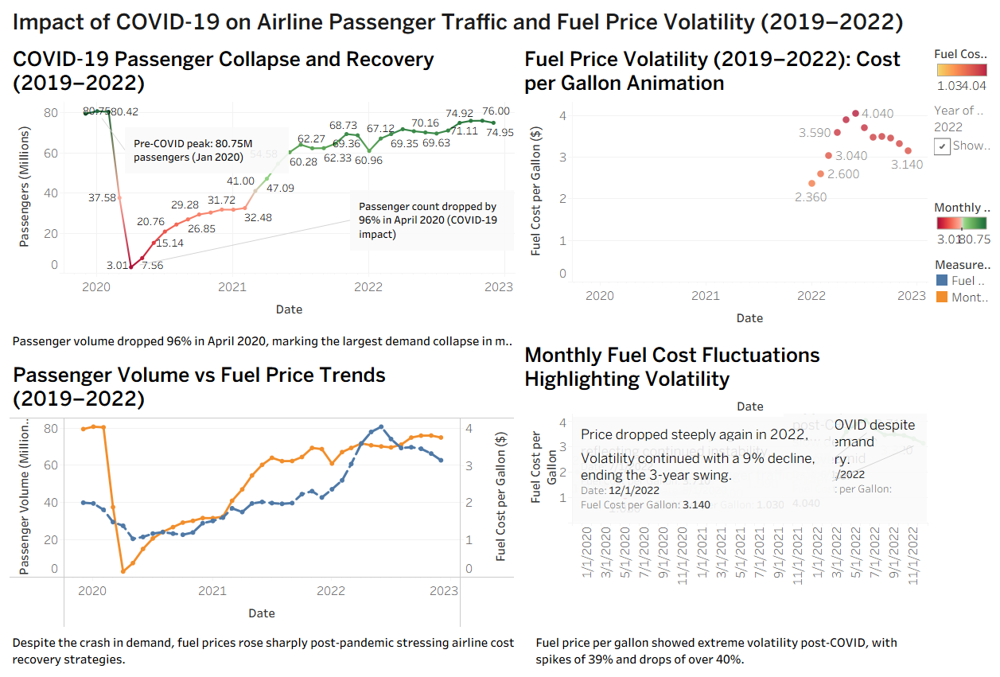

# COVID-19 Airline Passenger Traffic & Fuel Price Volatility Dashboard

## Project Overview
This data visualization project analyzes the impact of COVID-19 on airline passenger traffic and fuel price volatility between 2019 and 2022 using Tableau.

## Hypothesis
During the COVID-19 pandemic in 2020, U.S. airline passenger traffic dropped by more than 96% at its lowest point, contributing to an average annual decline of approximately 54%. During the recovery period, fuel prices experienced extreme volatility, including a 39.7% spike followed by sharp declines of 28% and 41%, creating one of the most unstable three-year fuel price trends in the airline industry.

## Objectives
- Analyze airline passenger traffic trends before, during, and after COVID-19
- Study fuel price volatility during the pandemic recovery period
- Compare passenger demand with fuel cost fluctuations
- Identify operational and economic impacts on the airline industry

## Tools Used
- Tableau
- Excel
- Data Cleaning
- Data Visualization

## Key Insights
- Passenger traffic collapsed by over 96% during April 2020
- Airline recovery remained unstable through 2022
- Fuel prices became highly volatile during post-pandemic recovery
- Airlines faced simultaneous demand disruption and operational cost pressure

## Files Included
- Tableau Dashboard Workbook (.twbx)
- Cleaned datasets (.xlsx)
- Dashboard screenshots
  
 ## Dashboard Preview

## Author
Sai Nischala Kuchibhotla
